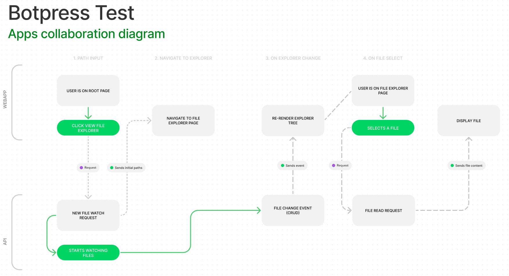

<div align="center">
  <h1>Botpress Test</h1>
</div>
<div align="center">
  <strong>Built using <a href="https://github.com/chocolat-chaud-io/stator">stator</a></strong>
</div>
</br>

<div align="center">
  <a href="http://commitizen.github.io/cz-cli/">
    
  </a>
  <a href="https://renovatebot.com">
    
  </a>
  <a href="https://github.com/semantic-release/semantic-release">
    
  </a>
  <a href="https://github.com/nestjs/nest">
    
  </a>
  <a href="https://github.com/juliandavidmr/awesome-nestjs#resources">
    
  </a>
  <a href="https://opensource.org/licenses/MIT">
    
  </a>
  <a href="http://makeapullrequest.com">
    
  </a>
  <a href="https://github.com/yann510/botpress-test">
    
  </a>
</div>

</br>

## 🚀 Quick Start

Please note that you need to use node version between `14` and `17`.

```
npm run apps
```

## Problem Statement

You need to build a “vs-code like” file explorer tree view with multiple collapsible sections. The
program needs to take as an argument one or multiple paths to local directories. Each directory
needs to be represented as an independent section in the rendered file explorer. When a file on
the host is deleted, added, removed or renamed within one of the specified directories, changes
should be reflected in the rendered file explorer.

The file explorer component should be rendered in a web browser. You are allowed to use any
library you want

## My creativity induced requirements

- Have the ability to input paths from the webapp
- Ensure the validity of the provided paths
- Display a VS Code like app on a different screen from the one we input paths
- Have the ability to expand and collapse folders
- Have the ability to view selected files
- Synchronize files/folders from host machine running the `api` server
- Be blazing fast
- Have a nice UX

## Considerations

- In the webapp, you need to input paths in the following format: e.g: /home/user/projects/git-repo
- Relative paths won't work
- node_modules and hidden files won't be displayed in the file explorer
- I decided not to use the [File System Access API](https://developer.mozilla.org/en-US/docs/Web/API/File_System_Access_API) as it is not supported by all major browsers + doesn't provide full file path for security reasons
- I'm using websockets to enable real time streaming of file events
- Only tested on a linux machine, should work fine with other OS too
- There are few extra files that were not required by this project, the relevant paths are `apps/webapp` and `apps/api`
- I'm using 2 different design system library (I prefer `mui`) and started with that, but the tree view wasn't performant enough so I ended up integrating `ant` only for the tree view
- Files with over 20,000 characters won't be displayed because highlightJS has not merged its [performance PR](https://gitlab.com/gitlab-org/gitlab/-/merge_requests/82806) yet
- Long paths will be trimmed in the file explorer

## Solution Diagram


